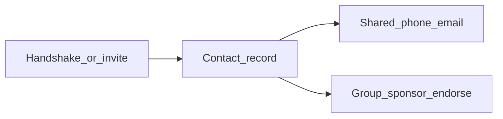

# FairShare overview

FairShare is built around **people you actually know**. The idea is a better contact manager: connect with a quick **handshake**, keep details fresh when someone updates their **profile card**, and grow **trust** over time—through vouching in communities and a private web-of-trust layer—without turning relationships into a performative scoreboard.

This page is a short product summary. For stack, schema, and RPCs, see [architecture.md](architecture.md). Current priorities and near-term ideas are in [ROADMAP.md](ROADMAP.md).

## Handshake and contacts

Meeting someone should create a contact with minimal friction. FairShare emphasizes **handshake-style flows** (including pointing two phones at each other) and a **contact list** sorted by recency, with quick access from the app chrome. Sponsoring someone into a group can also create **bidirectional contacts**, same as a meet handshake—see [sponsorship.md](sponsorship.md).

Backend expectations for profiles, shared fields, and realtime “someone shared with you” notifications are sketched in [contact-list-schema.md](contact-list-schema.md).

## Auto-updating contact info

Instead of static phone numbers in an address book, the model is a **living profile**: name, email, phone, photo (and optional **selfie** shared in the context of a contact pair). You choose what to **share** with each contact (e.g. phone and email checkboxes); when you update your card, what you’ve shared stays meaningful for the other person. Details and tables (`contact_shared`, `contact_shares`) are in [contact-list-schema.md](contact-list-schema.md).

## Vouching and a trust network

Two ideas reinforce each other:

1. **Groups and candidacy** — New members are **sponsored** with an invite link; existing members **endorse** until the constitution’s threshold is met. That is explicit **vouching** inside a community. Flow and schema: [sponsorship.md](sponsorship.md), membership diagram in [architecture.md](architecture.md).

2. **Web of Trust attestations** — For people you’ve met, you can send one-way **Trust** or **Love** signals. The system is designed for **privacy** (no visible history of what you sent; recipients only see **coarse aggregate** counts). Design and RPCs: [web-of-trust.md](web-of-trust.md).

**Planned extensions** (discovery, richer trust signals, mutual context) are tracked in [ROADMAP.md](ROADMAP.md).

## Groups, currency, and constitution

FairShare is also a **group currency** app: shared rules, transfers, votes on economic parameters, and a **constitution** that can be amended by member vote. That layer sits alongside contacts—not instead of them. Deep dives: [architecture.md](architecture.md), [constitution.md](constitution.md).

## How the pieces connect



## Screenshots (walk-through)

Store UI screenshots under [`images/`](images/) next to this file. In Markdown, embed with relative paths, for example:

```markdown


```

Suggested filenames (add PNG or WebP files when ready):

| File | Idea |
|------|------|
| `images/handshake-flow.png` | Pairing / handshake screens |
| `images/contacts-bar.png` | Contacts and handshake entry in the top bar |
| `images/profile-preferences.png` | Profile / preferences |
| `images/share-with-contact.png` | Share phone/email and toast |
| `images/group-home.png` | Group view, activity, currency |
| `images/candidates-sponsor.png` | Sponsor link and candidates / endorsements |

Until those files exist, the example syntax above will not show images in GitHub or local preview.
